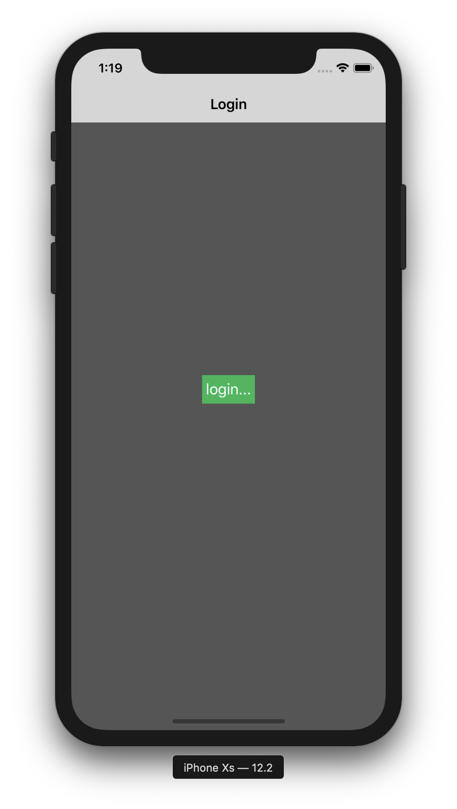

# Coordinator + MVVM

An iOS navigation coordinator written in Swift 5. 
This simple app displays Login and Logout Flow  with Coordinator and MVVM 

**Example:** 

## Credits
I hope it's helpful if you're exploring the pattern to use in a project. if you have any suggestions or improvements, feel free to submit a PR! 

I borrowed from a lot of examples around the community and want to thank / credit the following for inspiration and ideas:

[Dennis Walsh: Flow Coordinators in iOS](https://medium.com/@dkw5877/flow-coordinators-333ed64f3dd)  
[Paul Hudson: How to use the coordinator pattern in iOS apps](https://www.hackingwithswift.com/articles/71/how-to-use-the-coordinator-pattern-in-ios-apps)